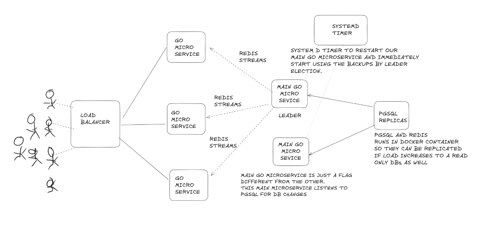
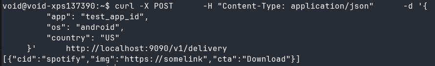
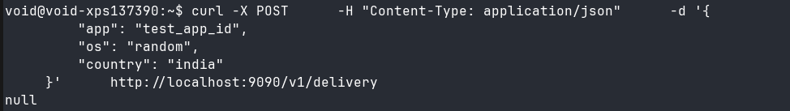
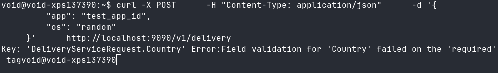
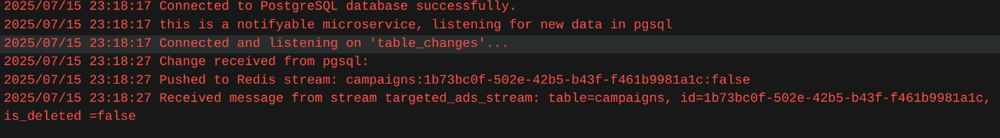

# targeted Ads microservice

## end goal
- I want to build an api for ads targeting system
- assume there are millions of phone, each phone sending request to our delivery endpoint, we need to efficiently respond to the request with the ads which are applicable to them based on certain target rules and catagories.
- There is also a possibility that the target rules and catagories gets updated so from the next req onwards i need to send them the updated ads
- constrain: millions of requests in a minute but few thousdands targeted ads and campaigns
- The primary objective is to build a robust API for an ad targeting system. This system must handle a massive volume of requests from user devices and efficiently respond with a list of applicable ads. A key requirement is the ability to update targeting rules and categories on the fly, with changes reflected in the API response for all subsequent requests without any service downtime.
## my design


## idea and intution behind my design
- The database layer uses PostgreSQL with Read Replicas. Since ad serving is a read-heavy operation, replicas allow us to scale database read capacity independently, preventing bottlenecks.
- to ensure fast responses and up-to-date ad delivery, the system uses an event-driven cache invalidation mechanism.
- In-Memory Cache via inverted indexing: Each worker microservice holds the targeting rules in memory for sub-millisecond lookups, avoiding a database hit for every request.
- Database Change Detection: The Main Go Microservice (Leader) subscribes to the PostgreSQL database using its native LISTEN/NOTIFY feature. It gets immediate notifications whenever targeting rules are added or updated in the database.
- Cache Propagation: Upon receiving a notification, the Leader fetches the new data and publishes it to a Redis Stream.
- Real-time Worker Updates: All worker microservices are subscribed to this Redis Stream. They receive the update and instantly refresh their in-memory cache.
-Decoupling: Redis Streams act as a durable message bus, decoupling the workers from the main service. If a worker is temporarily down, it can catch up on updates once it restarts. Thats the reason why I used redis streams instead of redis pub sub.
- Containerization: The entire data layer (PostgreSQL and Redis) runs within Docker, simplifying deployment, replication, and management.

## tools and packages I used
- golang
- go-kit for efficient microservice tooling
- postgres
- redis
- docker compose for both redis and postgres
- viper package for config management and environments
- uuid and validator from google 
- goose for pgsql migration management
- bash script for bootstraping 
- makefile for managing repeated tasks

## output

```bash
curl -X POST \
     -H "Content-Type: application/json" \
     -d '{
         "app": "test_app_id",
         "os": "android",
         "country": "US"
     }' \
     http://localhost:9090/v1/delivery
```
- when some criteria match

- when no criteria match

- when not all input fields are provided


- when we update database cache gets updated without reload


# additional improvements
- extensive logging
- monitoring
- load testing and additional unit testing
